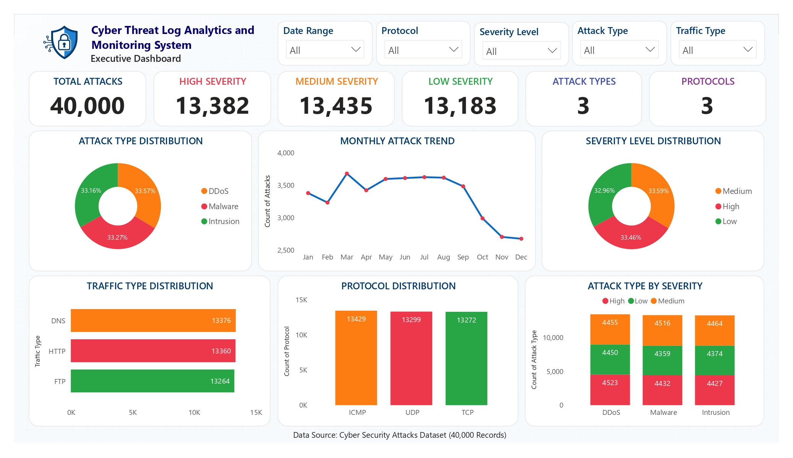

# 🛡️ Cyber Threat Log Analytics and Monitoring System

## Dashboard Preview



---

## 📌 Project Overview

The Cyber Threat Log Analytics and Monitoring System is a Data Analytics project developed using Python, SQL Server (SSMS), and Power BI to analyze and visualize cyber security attack data.

The project demonstrates an end-to-end analytics workflow including data cleaning, database management, SQL-based analysis, and interactive dashboard development.

---

## 🎯 Objectives

- Analyze cyber security attack records
- Identify attack patterns and threat severity
- Monitor protocol and network traffic distribution
- Perform SQL-based analytical queries
- Build interactive Power BI dashboards
- Generate actionable insights from cyber threat data

---

## 🛠️ Technologies Used

| Technology | Purpose |
|------------|---------|
| Python | Data Cleaning & Analysis |
| Pandas | Data Manipulation |
| Jupyter Notebook | Development Environment |
| SQL Server (SSMS) | Database Management |
| SQL | Data Analysis Queries |
| Power BI | Dashboard & Visualization |

---

## 📂 Repository Structure

```text
Cyber-Threat-Log-Analytics-and-Monitoring-System
│
├── Dataset
│   ├── cybersecurity_attacks.csv
│   └── Cyber_Attacks_Clean.csv
│
├── Python
│   └── Cyber_Threat_Analysis.ipynb
│
├── SQL
│   ├── Database_Schema.sql
│   └── Analysis_Queries.sql
│
├── PowerBI
│   └── Cyber_Threat_Dashboard.pbix
│
├── Dashboard.png
│
└── README.md
```

---

## 📊 Dataset Information

### Raw Dataset

**File:** `cybersecurity_attacks.csv`

Contains original cyber security attack records including:

- Missing values
- Raw timestamp data
- Unprocessed columns
- Original attack logs

### Cleaned Dataset

**File:** `Cyber_Attacks_Clean.csv`

Data preprocessing performed:

- Removed duplicate records
- Removed unnecessary columns
- Standardized column names
- Extracted Date and Time fields
- Prepared data for SQL Server and Power BI

---

## 🔄 Project Workflow

```text
Raw Cyber Security Dataset (CSV)
            ↓
Data Cleaning & Preprocessing (Python)
            ↓
Clean Dataset Export
            ↓
SQL Server Database (SSMS)
            ↓
SQL Analysis Queries
            ↓
Power BI Dashboard Development
            ↓
Reports & Insights
```

---

## 📈 Key Analysis Performed

### Attack Type Analysis

- DDoS Analysis
- Malware Analysis
- Intrusion Analysis

### Severity Analysis

- High Severity Threats
- Medium Severity Threats
- Low Severity Threats

### Network Analysis

- Protocol Distribution
- Traffic Type Analysis
- Network Segment Analysis

### Trend Analysis

- Monthly Attack Trends
- Attack Distribution Analysis
- Threat Monitoring Insights

---

## 📊 Dashboard Features

### Executive Dashboard

- Total Attack Records
- Severity Distribution
- Attack Type Distribution
- Protocol Analysis

### Attack Analysis Dashboard

- Attack Type Comparison
- Severity-wise Attack Distribution
- Threat Monitoring Insights

### Network Traffic Dashboard

- Traffic Type Analysis
- Protocol Distribution
- Network Activity Monitoring

### Trend Analysis Dashboard

- Monthly Attack Trends
- Threat Trend Monitoring
- Historical Attack Analysis

---

## 📌 Key Metrics

| KPI | Value |
|------|------:|
| Total Attack Records | 40,000 |
| High Severity Threats | 13,382 |
| Medium Severity Threats | 13,435 |
| Low Severity Threats | 13,183 |
| Attack Types | 3 |
| Protocols | 3 |

---

## 🗄️ SQL Analysis

The project includes SQL queries for:

- Total Attack Count
- Severity Analysis
- Attack Type Distribution
- Protocol Analysis
- Traffic Analysis
- Monthly Threat Trends
- Network Segment Analysis

---

## 📓 Python Analysis

The Jupyter Notebook contains:

- Data Loading
- Data Cleaning
- Missing Value Analysis
- Duplicate Detection
- Data Transformation
- Date & Time Extraction
- Dataset Preparation
- Exploratory Data Analysis (EDA)

**File:** `Cyber_Threat_Analysis.ipynb`

---

## 🎓 Learning Outcomes

This project helped strengthen practical skills in:

- Data Cleaning & Preprocessing
- SQL Query Development
- Database Management
- Data Analysis
- Data Visualization
- Dashboard Development
- Business Intelligence Reporting
- Cyber Security Analytics

---

## 🚀 Future Enhancements

- Real-Time Threat Monitoring
- Machine Learning-Based Threat Prediction
- Cloud Deployment (Azure/AWS)
- Automated Alert System
- Web-Based Monitoring Application

---

## 👨‍💻 Author

**Jayesh Bhimrao Kamble**

Master of Computer Applications (Data Science & Cloud Computing)

**Skills:** Python | SQL Server | Power BI | Data Analytics | Data Visualization | Business Intelligence

---

### Connect With Me

- LinkedIn: www.linkedin.com/in/jayeshbkamble
- GitHub: www.github.com/jayeshbkamble

---

⭐ If you found this project useful, consider giving it a star.
